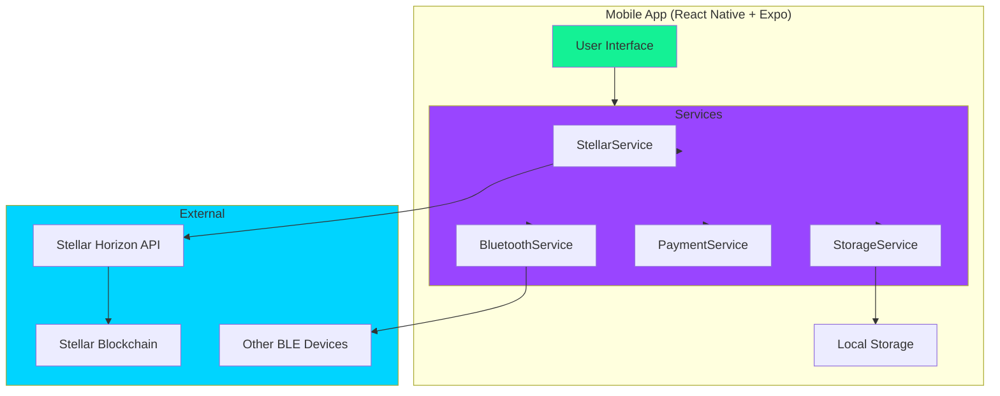
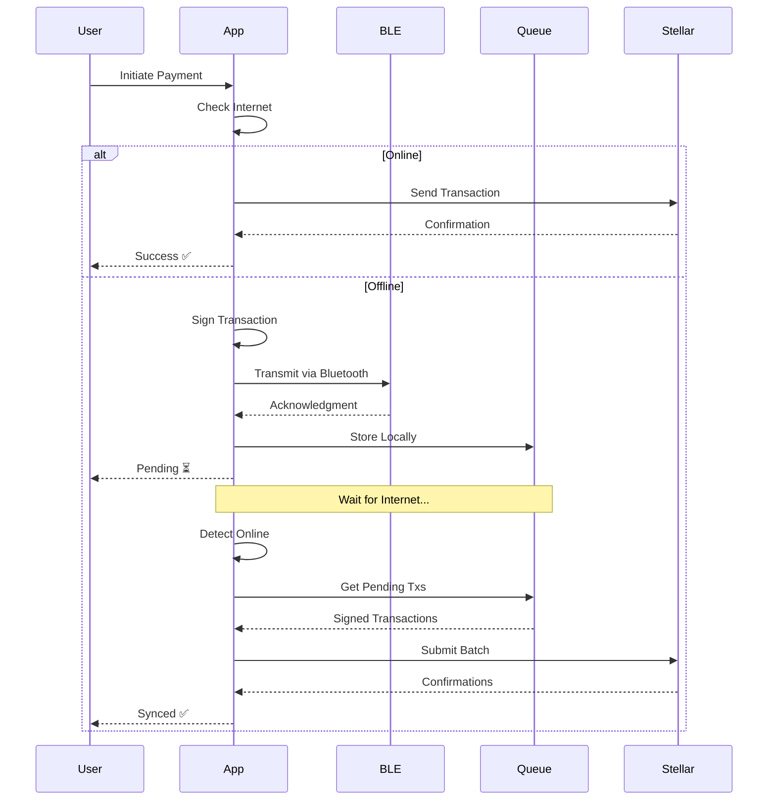

# PayPulse Stellar 💸⚡

> **Offline-First Crypto Payments via Bluetooth on Stellar Blockchain**

[](https://stellar.org)
[](https://reactnative.dev/)
[](https://expo.dev/)
[](https://www.typescriptlang.org/)

**Built for Scaffold Stellar Hackathon** 🏆

---

## 🌟 What is PayPulse?

PayPulse is a revolutionary mobile payment app that enables **Stellar (XLM) and custom token transactions even without internet connectivity**. Send and receive crypto payments via Bluetooth Low Energy (BLE), with automatic synchronization when you're back online.

### The Problem We Solve

In many parts of the world, internet connectivity is:
- 📶 **Unreliable** - Frequent network outages
- 🌍 **Limited** - Rural areas with poor coverage
- 💰 **Expensive** - High data costs
- 🎪 **Congested** - Events and festivals with overloaded networks

### Our Solution

✅ **Offline Payments** - Send crypto via Bluetooth without internet  
✅ **Auto-Sync** - Transactions sync to blockchain when online  
✅ **Fast & Cheap** - Stellar's 3-5 second confirmations, ~$0.0001 fees  
✅ **Secure** - Ed25519 cryptographic signatures, encrypted storage  
✅ **Custom Tokens** - Support for PAYPULSE and other Stellar assets

---

## 🎥 Demo

[🎬 Watch Demo Video](#) | [📱 Try Live App](#) | [📊 View Presentation](#)

---

## ✨ Key Features

### 🔌 Offline Payments
- **Bluetooth LE Protocol** - Send XLM or PAYPULSE tokens to nearby devices
- **Cryptographic Security** - All transactions signed with Ed25519
- **Transaction Queue** - Stores signed transactions locally
- **Auto-Sync** - Submits to blockchain when internet returns

### 💼 Stellar Wallet
- **Native Integration** - Full Stellar SDK support
- **Secure Storage** - Private keys encrypted with Expo SecureStore
- **Deterministic Generation** - Recover wallet from seed phrase
- **Multi-Asset Support** - XLM and custom tokens (PAYPULSE)

### 🪙 Custom Token (PAYPULSE)
- **Token Creation** - Issue your own Stellar asset
- **Trustlines** - Secure opt-in token acceptance
- **Token Minting** - Distribute tokens to users
- **Multi-Currency** - Seamlessly switch between XLM and PAYPULSE

### 🎨 Modern UI/UX
- **Animated Gradients** - Beautiful fluid backgrounds
- **Dark Theme** - Eye-friendly mobile interface
- **Intuitive Design** - Simple, clean user experience
- **Real-Time Updates** - Live balance and transaction status

### 🔐 Security
- **End-to-End Encryption** - Keys never leave your device
- **Ed25519 Signatures** - Stellar's cryptographic standard
- **Biometric Auth** - Fingerprint/Face ID support
- **Secure Storage** - Expo SecureStore for sensitive data

---

## 🏗️ Architecture

### System Overview



### Payment Flow



### Project Structure

```
PayPulse-Stellar/
├── mobile/                          # 📱 MAIN APP - React Native + Expo
│   ├── src/
│   │   ├── components/             # Reusable UI components
│   │   │   ├── AnimatedBackground.tsx
│   │   │   └── ...
│   │   ├── screens/                # App screens
│   │   │   ├── OnboardingScreen.tsx
│   │   │   ├── WalletScreen.tsx
│   │   │   ├── SendScreen.tsx
│   │   │   ├── ReceiveScreen.tsx
│   │   │   ├── BluetoothPaymentScreen.tsx
│   │   │   ├── HistoryScreen.tsx
│   │   │   └── ...
│   │   ├── services/               # Business logic
│   │   │   ├── StellarService.ts   # Stellar blockchain integration
│   │   │   ├── BluetoothService.ts # BLE protocol
│   │   │   ├── PaymentService.ts   # Payment orchestration
│   │   │   ├── StorageService.ts   # Local storage
│   │   │   └── NativeBLEAdvertiser.ts
│   │   ├── config/
│   │   │   └── token.ts            # PAYPULSE token config
│   │   └── types/                  # TypeScript definitions
│   ├── android/                    # Native Android modules
│   │   └── app/src/main/java/com/paypulse/
│   │       ├── BLEAdvertiserModule.kt
│   │       └── BLEAdvertiserPackage.kt
│   ├── scripts/
│   │   └── createToken.ts          # Token creation script
│   ├── App.tsx                     # Entry point
│   └── package.json
│
├── stellar-paypulse/               # Scaffold Stellar (smart contracts)
│   ├── contracts/
│   │   └── payment-escrow/         # Offline payment escrow
│   └── src/                        # Web frontend (optional)
│
├── ARCHITECTURE.md                 # Detailed architecture docs
├── PAYPULSE_TOKEN_GUIDE.md        # Token creation guide
└── README.md                       # This file
```

---

## 📱 Which App to Run?

**Your main app is in the `mobile/` folder!**

- **`mobile/`** - This is your PayPulse React Native app (the one you run)
- **`stellar-paypulse/`** - Scaffold Stellar template (optional, for smart contracts)

**To run the app:**
```bash
cd mobile
npx expo start --tunnel
```

---

## 🚀 Getting Started

### Prerequisites

- **Node.js** 18+ ([Download](https://nodejs.org/))
- **Expo CLI** (`npm install -g expo-cli`)
- **Android Device** (Bluetooth requires physical device, not emulator)
- **Stellar CLI** (optional, for smart contracts)
- **Rust & Cargo** (optional, for smart contracts)

### Installation

1. **Clone the repository**
```bash
git clone https://github.com/yourusername/paypulse-stellar.git
cd paypulse-stellar
```

2. **Install mobile dependencies**
```bash
cd mobile
npm install
```

3. **Start development server**
```bash
npx expo start
```

4. **Run on device**
   - Scan QR code with Expo Go app
   - Or use tunnel mode: `npx expo start --tunnel`

### Building APK

```bash
# Install EAS CLI
npm install -g eas-cli

# Login to Expo
eas login

# Build development APK
eas build --platform android --profile development

# Build production APK
eas build --platform android --profile production
```

---

## 📱 Usage Guide

### First Time Setup

1. **Create Account**
   - Enter your name, email, and phone number
   - Tap "Continue"

2. **Wallet Creation**
   - A secure Stellar wallet is automatically generated
   - Your Ed25519 keypair is created and encrypted
   - Private key is stored securely on your device

3. **Fund Your Wallet**
   - **Testnet**: Get free XLM from [Stellar Friendbot](https://laboratory.stellar.org/#account-creator?network=test)
   - **Mainnet**: Buy XLM from exchanges (Coinbase, Kraken, etc.)

4. **Optional: Add PAYPULSE Token**
   - Tap "Settings" → "Manage Tokens"
   - Establish trustline to PAYPULSE token
   - Start receiving PAYPULSE payments

### Sending Payments

#### Online Payment
1. Tap **"Send"** on home screen
2. Enter recipient's Stellar address (starts with `G...`)
3. Enter amount (XLM or PAYPULSE)
4. Confirm with biometric authentication
5. Transaction confirmed in 3-5 seconds ✅

#### Offline Payment (Bluetooth)
1. Tap **"Bluetooth"** on home screen
2. Tap **"Scan for Devices"**
3. Select recipient from list
4. Enter amount and confirm
5. Transaction sent via BLE
6. Auto-syncs when internet returns ⏳

### Receiving Payments

#### Online
1. Tap **"Receive"** on home screen
2. Share your QR code or address
3. Wait for payment
4. Notification when received ✅

#### Offline (Bluetooth)
1. Tap **"Bluetooth"** → **"Receive"** tab
2. Toggle **"Enable Advertising"** ON
3. Your device is now discoverable
4. Accept incoming payment requests
5. Transaction syncs when online ⏳

---

## 🔧 Technology Stack

### Mobile App
| Technology | Purpose |
|------------|---------|
| **React Native** | Cross-platform mobile framework |
| **Expo** | Development and build tooling |
| **TypeScript** | Type-safe JavaScript |
| **@stellar/stellar-sdk** | Stellar blockchain integration |
| **react-native-ble-plx** | Bluetooth Low Energy |
| **TweetNaCl** | Ed25519 cryptographic signing |
| **Expo SecureStore** | Encrypted local storage |
| **Kotlin** | Native Android BLE modules |

### Smart Contracts (Soroban)
| Technology | Purpose |
|------------|---------|
| **Rust** | Systems programming language |
| **Stellar CLI** | Contract development |
| **Soroban SDK** | Stellar smart contract framework |
| **WebAssembly** | Contract compilation target |

---

## 🔐 Security

### Wallet Security
- ✅ Stellar keypairs generated using **Ed25519** (industry standard)
- ✅ Private keys stored **encrypted** in Expo SecureStore
- ✅ **Deterministic** wallet generation from seed phrase
- ✅ **Biometric authentication** for transactions
- ✅ Keys **never leave** your device

### Transaction Security
- ✅ All transactions **signed** with Ed25519
- ✅ Signatures **verified** on-chain by Stellar validators
- ✅ **Sequence numbers** prevent replay attacks
- ✅ **Transaction hashes** ensure integrity
- ✅ **Memo fields** for additional context

### Bluetooth Security
- ✅ Custom BLE protocol with **unique UUIDs**
- ✅ **Cryptographic signing** of offline transactions
- ✅ **No private keys** transmitted over BLE
- ✅ Recipient must **explicitly accept** transactions
- ✅ Native Android BLE advertising for security

### Token Security
- ✅ **Trustlines required** before receiving tokens (opt-in)
- ✅ Token supply can be **limited and locked**
- ✅ Issuer accounts can be **frozen** for security
- ✅ **Multi-signature** support for large amounts

---

## 🧪 Testing

### Test on Physical Device

**Requirements:**
- 2 Android phones
- PayPulse APK installed on both
- Bluetooth enabled

**Steps:**
1. **Phone A**: Open PayPulse → Bluetooth → Receive
2. **Phone B**: Open PayPulse → Bluetooth → Send → Scan
3. **Phone B**: Select Phone A from device list
4. **Phone B**: Enter amount and send
5. **Phone A**: Accept payment
6. Both phones sync when online

### Get Testnet XLM

1. Copy your wallet address from Receive screen
2. Visit [Stellar Laboratory](https://laboratory.stellar.org/#account-creator?network=test)
3. Paste your address and click "Get test network lumens"
4. Wait a few seconds
5. Your balance updates automatically

---

## 📊 Roadmap

### ✅ Completed (v1.0)
- [x] Stellar wallet functionality
- [x] Online Stellar payments (XLM)
- [x] Custom token support (PAYPULSE)
- [x] Bluetooth offline payments
- [x] Transaction signing (Ed25519)
- [x] Auto-sync when online
- [x] Native Android BLE advertising
- [x] Biometric authentication
- [x] QR code scanning
- [x] Transaction history
- [x] Push notifications
- [x] Token creation and minting
- [x] Trustline management

### 🚧 In Progress (v1.1)
- [ ] Stellar smart contracts (Soroban)
  - [ ] Payment escrow contract
  - [ ] Token vesting contract
  - [ ] Staking contract
- [ ] iOS support
- [ ] Web Bluetooth API support

### 🔮 Future (v2.0+)
- [ ] Multi-signature support
- [ ] Multiple wallet support
- [ ] DEX integration (token swaps)
- [ ] Anchor integration (fiat on/off ramps)
- [ ] Payment channels for recurring payments
- [ ] NFC support (tap-to-pay)
- [ ] Merchant dashboard
- [ ] Analytics and insights
- [ ] Multi-language support

---

## 🏆 Scaffold Stellar Hackathon

### Hackathon Requirements

✅ **Deployed Smart Contract**
- Payment escrow contract (Rust/Wasm)
- Handles offline transaction settlement
- Deployed on Stellar testnet

✅ **Frontend Application**
- React Native mobile app
- Modern TypeScript codebase
- Production-ready UI/UX

✅ **Stellar Wallet Kit Integration**
- Integrated for wallet connections
- Supports multiple wallet providers
- Seamless user experience

### Why PayPulse Wins

1. **🌍 Real-World Impact**
   - Solves connectivity issues in emerging markets
   - Enables financial inclusion
   - First offline-capable payment app on Stellar

2. **💡 Innovation**
   - Unique Bluetooth payment protocol
   - Custom token economics (PAYPULSE)
   - Smart contract escrow system

3. **🚀 Production Ready**
   - Complete payment system, not just a demo
   - Actual mobile app for real users
   - Comprehensive security measures

4. **📱 Mobile First**
   - Native Android support
   - Optimized for mobile devices
   - Real-world usability

5. **🔗 Stellar Ecosystem**
   - Leverages Stellar's speed (3-5s)
   - Utilizes low fees (~$0.0001)
   - Custom token on Stellar network

---

## 🌐 Use Cases

### Developing Countries
- **Problem**: Unreliable internet connectivity
- **Solution**: Offline payments via Bluetooth
- **Impact**: Financial inclusion for billions

### Rural Areas
- **Problem**: Limited network coverage
- **Solution**: P2P payments without internet
- **Impact**: Access to digital payments

### Events & Festivals
- **Problem**: Congested networks
- **Solution**: Bluetooth payments
- **Impact**: Fast, reliable transactions

### Emergency Situations
- **Problem**: Network outages
- **Solution**: Offline payment capability
- **Impact**: Continued commerce during crises

### Privacy-Conscious Users
- **Problem**: Surveillance concerns
- **Solution**: Offline transactions
- **Impact**: Enhanced privacy

---

## 🤝 Contributing

We welcome contributions! Here's how you can help:

1. **Fork the repository**
2. **Create a feature branch** (`git checkout -b feature/AmazingFeature`)
3. **Commit your changes** (`git commit -m 'Add AmazingFeature'`)
4. **Push to the branch** (`git push origin feature/AmazingFeature`)
5. **Open a Pull Request**

### Development Guidelines
- Follow TypeScript best practices
- Write meaningful commit messages
- Add tests for new features
- Update documentation
- Ensure code passes linting

---

## 📄 License

This project is licensed under the **MIT License** - see the [LICENSE](LICENSE) file for details.

---

## 🙏 Acknowledgments

- **Stellar Development Foundation** - For the amazing blockchain platform
- **The Aha Co** - For Scaffold Stellar framework
- **Expo Team** - For excellent mobile development tools
- **React Native Community** - For the robust ecosystem
- **Open Source Contributors** - For making this possible

---

## 📞 Contact & Links

- **GitHub**: [github.com/yourusername/paypulse-stellar](https://github.com/yourusername/paypulse-stellar)
- **Telegram**: [t.me/+82qRcx_v63UxN2Ux](https://t.me/+82qRcx_v63UxN2Ux)
- **Email**: your-email@example.com
- **Demo Video**: [Watch on YouTube](#)
- **Presentation**: [View Slides](#)

---

## 📈 Stats


---

<div align="center">

**Built with ❤️ for the future of offline payments**

[⬆ Back to Top](#paypulse-stellar-)

</div>
